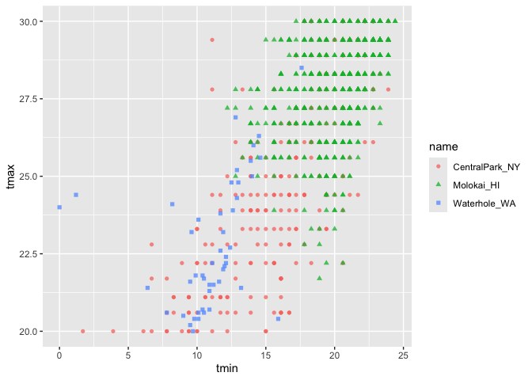

EDA
================
Yuying Lu
2024-09-26

``` r
library(tidyverse)
library(ggridges)
```

Import the weather data

``` r
weather_df = 
  rnoaa::meteo_pull_monitors(
    c("USW00094728", "USW00022534", "USS0023B17S"),
    var = c("PRCP", "TMIN", "TMAX"), 
    date_min = "2021-01-01",
    date_max = "2022-12-31") |>
  mutate(
    name = case_match(
      id, 
      "USW00094728" ~ "CentralPark_NY", 
      "USW00022534" ~ "Molokai_HI",
      "USS0023B17S" ~ "Waterhole_WA"),
    tmin = tmin / 10,
    tmax = tmax / 10,
    month = lubridate::floor_date(date, unit = "month")) |>
  select(name, id, everything())

weather_df
```

    ## # A tibble: 2,190 × 7
    ##    name           id          date        prcp  tmax  tmin month     
    ##    <chr>          <chr>       <date>     <dbl> <dbl> <dbl> <date>    
    ##  1 CentralPark_NY USW00094728 2021-01-01   157   4.4   0.6 2021-01-01
    ##  2 CentralPark_NY USW00094728 2021-01-02    13  10.6   2.2 2021-01-01
    ##  3 CentralPark_NY USW00094728 2021-01-03    56   3.3   1.1 2021-01-01
    ##  4 CentralPark_NY USW00094728 2021-01-04     5   6.1   1.7 2021-01-01
    ##  5 CentralPark_NY USW00094728 2021-01-05     0   5.6   2.2 2021-01-01
    ##  6 CentralPark_NY USW00094728 2021-01-06     0   5     1.1 2021-01-01
    ##  7 CentralPark_NY USW00094728 2021-01-07     0   5    -1   2021-01-01
    ##  8 CentralPark_NY USW00094728 2021-01-08     0   2.8  -2.7 2021-01-01
    ##  9 CentralPark_NY USW00094728 2021-01-09     0   2.8  -4.3 2021-01-01
    ## 10 CentralPark_NY USW00094728 2021-01-10     0   5    -1.6 2021-01-01
    ## # ℹ 2,180 more rows

``` r
weather_df |> 
  ggplot(aes(x = prcp)) + 
  geom_histogram()
```

<!-- -->

``` r
weather_df |> 
  filter(prcp >= 1000)
```

    ## # A tibble: 3 × 7
    ##   name           id          date        prcp  tmax  tmin month     
    ##   <chr>          <chr>       <date>     <dbl> <dbl> <dbl> <date>    
    ## 1 CentralPark_NY USW00094728 2021-08-21  1130  27.8  22.8 2021-08-01
    ## 2 CentralPark_NY USW00094728 2021-09-01  1811  25.6  17.2 2021-09-01
    ## 3 Molokai_HI     USW00022534 2022-12-18  1120  23.3  18.9 2022-12-01

``` r
weather_df |> 
  filter(tmax >= 20, tmax <= 30) |> 
  ggplot(aes(x = tmin, y = tmax, color = name, shape = name)) + 
  geom_point(alpha = .75)
```

<!-- -->

## Group_by

``` r
weather_df |> 
  group_by(name)
```

    ## # A tibble: 2,190 × 7
    ## # Groups:   name [3]
    ##    name           id          date        prcp  tmax  tmin month     
    ##    <chr>          <chr>       <date>     <dbl> <dbl> <dbl> <date>    
    ##  1 CentralPark_NY USW00094728 2021-01-01   157   4.4   0.6 2021-01-01
    ##  2 CentralPark_NY USW00094728 2021-01-02    13  10.6   2.2 2021-01-01
    ##  3 CentralPark_NY USW00094728 2021-01-03    56   3.3   1.1 2021-01-01
    ##  4 CentralPark_NY USW00094728 2021-01-04     5   6.1   1.7 2021-01-01
    ##  5 CentralPark_NY USW00094728 2021-01-05     0   5.6   2.2 2021-01-01
    ##  6 CentralPark_NY USW00094728 2021-01-06     0   5     1.1 2021-01-01
    ##  7 CentralPark_NY USW00094728 2021-01-07     0   5    -1   2021-01-01
    ##  8 CentralPark_NY USW00094728 2021-01-08     0   2.8  -2.7 2021-01-01
    ##  9 CentralPark_NY USW00094728 2021-01-09     0   2.8  -4.3 2021-01-01
    ## 10 CentralPark_NY USW00094728 2021-01-10     0   5    -1.6 2021-01-01
    ## # ℹ 2,180 more rows

``` r
weather_df |> 
  group_by(name) |> summarise(n_obs = n(),
                              n_dist = n_distinct(month))
```

    ## # A tibble: 3 × 3
    ##   name           n_obs n_dist
    ##   <chr>          <int>  <int>
    ## 1 CentralPark_NY   730     24
    ## 2 Molokai_HI       730     24
    ## 3 Waterhole_WA     730     24

``` r
weather_df |> 
  group_by(name, month) |> summarise(n_obs = n())
```

    ## # A tibble: 72 × 3
    ## # Groups:   name [3]
    ##    name           month      n_obs
    ##    <chr>          <date>     <int>
    ##  1 CentralPark_NY 2021-01-01    31
    ##  2 CentralPark_NY 2021-02-01    28
    ##  3 CentralPark_NY 2021-03-01    31
    ##  4 CentralPark_NY 2021-04-01    30
    ##  5 CentralPark_NY 2021-05-01    31
    ##  6 CentralPark_NY 2021-06-01    30
    ##  7 CentralPark_NY 2021-07-01    31
    ##  8 CentralPark_NY 2021-08-01    31
    ##  9 CentralPark_NY 2021-09-01    30
    ## 10 CentralPark_NY 2021-10-01    31
    ## # ℹ 62 more rows

``` r
weather_df |> 
  count(name)
```

    ## # A tibble: 3 × 2
    ##   name               n
    ##   <chr>          <int>
    ## 1 CentralPark_NY   730
    ## 2 Molokai_HI       730
    ## 3 Waterhole_WA     730

``` r
weather_df |> 
  drop_na(tmax) |> 
  mutate(
    cold = case_when(
      tmax < 5 ~ 'cold',
      tmax >= 5 ~ 'not_cold'
    )
  ) |> 
  group_by(name, cold) |> 
  summarize(count = n())
```

    ## # A tibble: 5 × 3
    ## # Groups:   name [3]
    ##   name           cold     count
    ##   <chr>          <chr>    <int>
    ## 1 CentralPark_NY cold        96
    ## 2 CentralPark_NY not_cold   634
    ## 3 Molokai_HI     not_cold   729
    ## 4 Waterhole_WA   cold       319
    ## 5 Waterhole_WA   not_cold   395

``` r
weather_df |> 
  drop_na(tmax) |> 
  mutate(
    cold = case_when(
      tmax < 5 ~ 'cold',
      tmax >= 5 ~ 'not_cold'
    )
  ) |> 
  janitor::tabyl(name, cold)
```

    ##            name cold not_cold
    ##  CentralPark_NY   96      634
    ##      Molokai_HI    0      729
    ##    Waterhole_WA  319      395

## General

Let’t try some other useful summaries

``` r
weather_df |> 
  group_by(name, month) |> 
  summarize(
    mean_tmax = mean(tmax, na.rm = TRUE),
    median_tmin = median(tmin, na.rm = TRUE),
    sd_prop = sd(prcp, na.rm = TRUE)
  )
```

    ## # A tibble: 72 × 5
    ## # Groups:   name [3]
    ##    name           month      mean_tmax median_tmin sd_prop
    ##    <chr>          <date>         <dbl>       <dbl>   <dbl>
    ##  1 CentralPark_NY 2021-01-01      4.27       -0.5     47.3
    ##  2 CentralPark_NY 2021-02-01      3.87       -1.85    98.1
    ##  3 CentralPark_NY 2021-03-01     12.3         5       71.3
    ##  4 CentralPark_NY 2021-04-01     17.6         8.05    52.4
    ##  5 CentralPark_NY 2021-05-01     22.1        11.1     74.7
    ##  6 CentralPark_NY 2021-06-01     28.1        18.0     43.3
    ##  7 CentralPark_NY 2021-07-01     28.4        21.1    151. 
    ##  8 CentralPark_NY 2021-08-01     28.8        22.2    236. 
    ##  9 CentralPark_NY 2021-09-01     24.8        17.5    333. 
    ## 10 CentralPark_NY 2021-10-01     19.9        13.9    151. 
    ## # ℹ 62 more rows

summarize and then plot …

``` r
weather_df |> 
  group_by(name, month) |> 
  summarize(
    mean_tmax = mean(tmax, na.rm = TRUE),
    median_tmin = median(tmin, na.rm = TRUE),
    sd_prop = sd(prcp, na.rm = TRUE)
  ) |> 
  ggplot(aes(x = month, y = mean_tmax, color = name))+
  geom_point() +
  geom_line()
```

<!-- -->

format for readers

``` r
weather_df |> 
  group_by(name, month) |> 
  summarize(
    mean_tmax = mean(tmax, na.rm = TRUE)
  ) |> 
  pivot_wider(
    names_from = name,
    values_from = mean_tmax) |> 
  knitr::kable(digits = 3,
               col.names = c('Month', 'Central Park', 'Molokai', 'Waterhole'))
```

| Month      | Central Park | Molokai | Waterhole |
|:-----------|-------------:|--------:|----------:|
| 2021-01-01 |        4.271 |  27.616 |     0.800 |
| 2021-02-01 |        3.868 |  26.368 |    -0.786 |
| 2021-03-01 |       12.294 |  25.861 |     2.623 |
| 2021-04-01 |       17.607 |  26.567 |     6.097 |
| 2021-05-01 |       22.084 |  28.577 |     8.203 |
| 2021-06-01 |       28.057 |  29.587 |    15.253 |
| 2021-07-01 |       28.352 |  29.994 |    17.335 |
| 2021-08-01 |       28.810 |  29.523 |    17.152 |
| 2021-09-01 |       24.787 |  29.673 |    12.647 |
| 2021-10-01 |       19.926 |  29.129 |     5.481 |
| 2021-11-01 |       11.537 |  28.847 |     3.533 |
| 2021-12-01 |        9.587 |  26.190 |    -2.097 |
| 2022-01-01 |        2.855 |  26.606 |     3.606 |
| 2022-02-01 |        7.650 |  26.829 |     2.989 |
| 2022-03-01 |       11.990 |  27.726 |     3.416 |
| 2022-04-01 |       15.810 |  27.723 |     2.463 |
| 2022-05-01 |       22.255 |  28.283 |     5.810 |
| 2022-06-01 |       26.090 |  29.157 |    11.127 |
| 2022-07-01 |       30.723 |  29.529 |    15.861 |
| 2022-08-01 |       30.500 |  30.697 |    18.830 |
| 2022-09-01 |       24.923 |  30.413 |    15.207 |
| 2022-10-01 |       17.426 |  29.223 |    11.884 |
| 2022-11-01 |       14.017 |  27.960 |     2.140 |
| 2022-12-01 |        6.761 |  27.348 |    -0.460 |

## grouped mutates

``` r
weather_df |> 
  group_by(name) |> 
  mutate(mean_tmax = mean(tmax, na.rm = TRUE),
         centered_tmax = tmax - mean_tmax) |> 
  ggplot(aes(x = date, y = centered_tmax, color = name)) + 
  geom_point()
```

<!-- -->

Find hottest / coldest days.

``` r
weather_df |> 
  group_by(name) |> 
  mutate(
    temp_rank = min_rank(tmax)
  ) |> 
  filter(temp_rank < 3)
```

    ## # A tibble: 7 × 8
    ## # Groups:   name [3]
    ##   name           id          date        prcp  tmax  tmin month      temp_rank
    ##   <chr>          <chr>       <date>     <dbl> <dbl> <dbl> <date>         <int>
    ## 1 CentralPark_NY USW00094728 2022-01-15     0  -6   -12.1 2022-01-01         2
    ## 2 CentralPark_NY USW00094728 2022-12-24     0  -9.3 -13.8 2022-12-01         1
    ## 3 Molokai_HI     USW00022534 2021-01-18   234  22.2  19.4 2021-01-01         2
    ## 4 Molokai_HI     USW00022534 2021-03-18   142  21.7  18.9 2021-03-01         1
    ## 5 Molokai_HI     USW00022534 2022-11-28    56  22.2  20.6 2022-11-01         2
    ## 6 Waterhole_WA   USS0023B17S 2021-12-26   102 -11.4 -18.3 2021-12-01         1
    ## 7 Waterhole_WA   USS0023B17S 2021-12-27    25  -9.8 -19.6 2021-12-01         2

``` r
weather_df |> 
  group_by(name) |> 
  filter(min_rank(tmax) < 4)
```

    ## # A tibble: 9 × 7
    ## # Groups:   name [3]
    ##   name           id          date        prcp  tmax  tmin month     
    ##   <chr>          <chr>       <date>     <dbl> <dbl> <dbl> <date>    
    ## 1 CentralPark_NY USW00094728 2022-01-15     0  -6   -12.1 2022-01-01
    ## 2 CentralPark_NY USW00094728 2022-01-21     0  -5.5  -9.9 2022-01-01
    ## 3 CentralPark_NY USW00094728 2022-12-24     0  -9.3 -13.8 2022-12-01
    ## 4 Molokai_HI     USW00022534 2021-01-18   234  22.2  19.4 2021-01-01
    ## 5 Molokai_HI     USW00022534 2021-03-18   142  21.7  18.9 2021-03-01
    ## 6 Molokai_HI     USW00022534 2022-11-28    56  22.2  20.6 2022-11-01
    ## 7 Waterhole_WA   USS0023B17S 2021-12-26   102 -11.4 -18.3 2021-12-01
    ## 8 Waterhole_WA   USS0023B17S 2021-12-27    25  -9.8 -19.6 2021-12-01
    ## 9 Waterhole_WA   USS0023B17S 2022-12-21     0  -9.6 -18.4 2022-12-01

``` r
weather_df |> 
  group_by(name) |> 
  filter(min_rank(tmax) < 4) |> 
  arrange(desc(tmax))
```

    ## # A tibble: 9 × 7
    ## # Groups:   name [3]
    ##   name           id          date        prcp  tmax  tmin month     
    ##   <chr>          <chr>       <date>     <dbl> <dbl> <dbl> <date>    
    ## 1 Molokai_HI     USW00022534 2021-01-18   234  22.2  19.4 2021-01-01
    ## 2 Molokai_HI     USW00022534 2022-11-28    56  22.2  20.6 2022-11-01
    ## 3 Molokai_HI     USW00022534 2021-03-18   142  21.7  18.9 2021-03-01
    ## 4 CentralPark_NY USW00094728 2022-01-21     0  -5.5  -9.9 2022-01-01
    ## 5 CentralPark_NY USW00094728 2022-01-15     0  -6   -12.1 2022-01-01
    ## 6 CentralPark_NY USW00094728 2022-12-24     0  -9.3 -13.8 2022-12-01
    ## 7 Waterhole_WA   USS0023B17S 2022-12-21     0  -9.6 -18.4 2022-12-01
    ## 8 Waterhole_WA   USS0023B17S 2021-12-27    25  -9.8 -19.6 2021-12-01
    ## 9 Waterhole_WA   USS0023B17S 2021-12-26   102 -11.4 -18.3 2021-12-01

``` r
weather_df |> 
  group_by(name) |> 
  mutate(
    lagged_tmax = lag(tmax),
    temp_change = tmax - lagged_tmax
  ) |> 
  filter(min_rank(temp_change)<3)
```

    ## # A tibble: 6 × 9
    ## # Groups:   name [3]
    ##   name     id    date        prcp  tmax  tmin month      lagged_tmax temp_change
    ##   <chr>    <chr> <date>     <dbl> <dbl> <dbl> <date>           <dbl>       <dbl>
    ## 1 Central… USW0… 2022-02-24     0   1.7  -1.6 2022-02-01        20         -18.3
    ## 2 Central… USW0… 2022-12-24     0  -9.3 -13.8 2022-12-01        14.4       -23.7
    ## 3 Molokai… USW0… 2021-01-18   234  22.2  19.4 2021-01-01        27.8        -5.6
    ## 4 Molokai… USW0… 2022-11-28    56  22.2  20.6 2022-11-01        27.2        -5  
    ## 5 Waterho… USS0… 2021-06-30     0  21.5  10.9 2021-06-01        32.4       -10.9
    ## 6 Waterho… USS0… 2022-06-28     0  12.4   5.7 2022-06-01        23.6       -11.2

``` r
weather_df |> 
  group_by(name) |> 
  mutate(
    lagged_tmax = lag(tmax),
    temp_change = tmax - lagged_tmax
  ) |> 
  summarise(
    sd_tmax_change = sd(temp_change, na.rm = TRUE)
  )
```

    ## # A tibble: 3 × 2
    ##   name           sd_tmax_change
    ##   <chr>                   <dbl>
    ## 1 CentralPark_NY           4.43
    ## 2 Molokai_HI               1.24
    ## 3 Waterhole_WA             3.04

### Exercise PULSE data

``` r
pulse_df = haven::read_sas("./data/public_pulse_data.sas7bdat") |> 
  janitor::clean_names() |>
  pivot_longer(
    bdi_score_bl:bdi_score_12m,
    names_to = "visit", 
    names_prefix = "bdi_score_",
    values_to = "bdi") |>
  select(id, visit, everything()) |>
  mutate(
    visit = replace(visit, visit == "bl", "00m"),
    visit = factor(visit, levels = str_c(c("00", "01", "06", "12"), "m"))) |>
  arrange(id, visit)

pulse_df |> 
  group_by(visit) |> 
  summarize(
    mean_bdi = mean(bdi, na.rm = TRUE),
    median_bdi = median(bdi, na.rm = TRUE)) |> 
  knitr::kable(digits = 3)
```

| visit | mean_bdi | median_bdi |
|:------|---------:|-----------:|
| 00m   |    7.995 |          6 |
| 01m   |    6.046 |          4 |
| 06m   |    5.672 |          4 |
| 12m   |    6.097 |          4 |

## FAS

``` r
litters_df = 
  read_csv("data/FAS_litters.csv", na = c("NA", " ", ".")) |> 
  janitor::clean_names() |> 
  separate(
    group, into = c("dose", "tx_day"), sep = 3
  )

pups_df = 
  read_csv("data/FAS_pups.csv", na = c("NA", " ", ".")) |> 
  janitor::clean_names() 
  
fas_df = 
  left_join(pups_df, litters_df, by = "litter_number")

fas_df
```

    ## # A tibble: 313 × 14
    ##    litter_number   sex pd_ears pd_eyes pd_pivot pd_walk dose  tx_day gd0_weight
    ##    <chr>         <dbl>   <dbl>   <dbl>    <dbl>   <dbl> <chr> <chr>       <dbl>
    ##  1 #85               1       4      13        7      11 Con   7            19.7
    ##  2 #85               1       4      13        7      12 Con   7            19.7
    ##  3 #1/2/95/2         1       5      13        7       9 Con   7            27  
    ##  4 #1/2/95/2         1       5      13        8      10 Con   7            27  
    ##  5 #5/5/3/83/3-3     1       5      13        8      10 Con   7            26  
    ##  6 #5/5/3/83/3-3     1       5      14        6       9 Con   7            26  
    ##  7 #5/4/2/95/2       1      NA      14        5       9 Con   7            28.5
    ##  8 #4/2/95/3-3       1       4      13        6       8 Con   7            NA  
    ##  9 #4/2/95/3-3       1       4      13        7       9 Con   7            NA  
    ## 10 #2/2/95/3-2       1       4      NA        8      10 Con   7            NA  
    ## # ℹ 303 more rows
    ## # ℹ 5 more variables: gd18_weight <dbl>, gd_of_birth <dbl>,
    ## #   pups_born_alive <dbl>, pups_dead_birth <dbl>, pups_survive <dbl>

Compute a table we care about

``` r
fas_df |> 
  drop_na(dose) |> 
  group_by(dose, tx_day) |> 
  summarise(mean_pivot = mean(pd_pivot, na.rm = TRUE)) |> 
  pivot_wider(
    names_from = tx_day,
    values_from = mean_pivot
  ) |> 
  knitr::kable(digits = 3)
```

| dose |     7 |     8 |
|:-----|------:|------:|
| Con  | 7.000 | 6.236 |
| Low  | 7.939 | 7.721 |
| Mod  | 6.984 | 7.042 |
